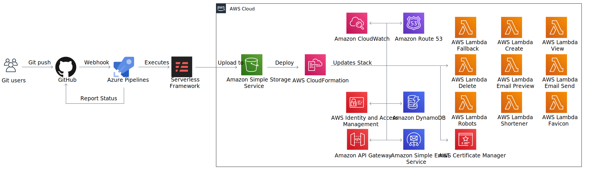
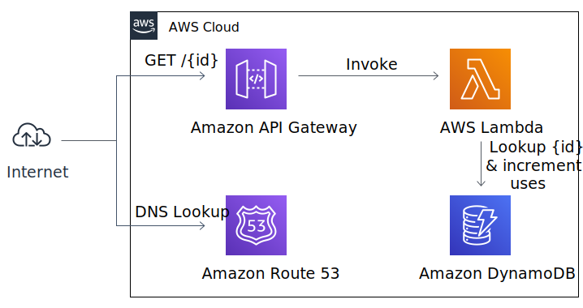
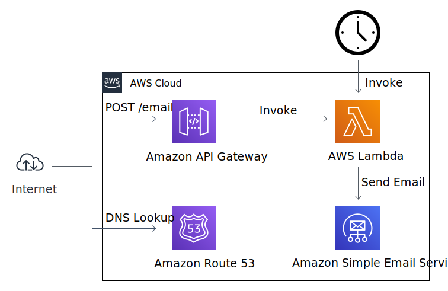

# Link Shortener

[](https://dev.azure.com/thebeanogamer/linkshortener/_build/latest?definitionId=5&branchName=master) [](https://dev.azure.com/thebeanogamer/linkshortener/_build/latest?definitionId=6&branchName=master)  

This project is an over-engineered Link Shortener built using as many AWS services as was reasonably possible. An example deployment of this is available on <https://beano.dev>.

## Usage

### Deploy

Before running the deployment, you must manually create a certificate for your domain in `us-east-1` and configure SES and Route 53 in a region of your choice. Unless you request a usage limit increase from AWS, you will need to manually [verify your email](https://docs.aws.amazon.com/ses/latest/DeveloperGuide/sending-authorization-identity-owner-tasks-verification.html) within SES. You will also need to set the following environment variables on the deploying machine.

Variable | Value
--- | ---
`ADMIN_CONTACT` | The email address for updates to be sent to
`DOMAIN` | The domain your shortener will be hosted on
`FALLBACK_URL` | The URL to redirect to in the absence of a specifically defined one
`REGION` | The region to deploy to
`SES_REGION` | The region where you have configured SES

```bash
npm install
serverless create_domain --stage prod # This only needs to be run once but may take up to 40 mins
serverless deploy --stage prod
```

### Database

The database used is DynamoDB, below can be seen an example record which would redirect from `/blog` to `https://blog.daniel-milnes.uk`.

```json
{
  "code": "blog",
  "url": "https://blog.daniel-milnes.uk",
  "uses": {
    "lifetime": 0,
    "recent": 0
  }
}
```

### Emails

Link Shortener tracks two values for usage, `lifetime` and `recent`. The `recent` key is cleared every time a usage summary is generated. A summary will be sent to the email defined in the `ADMIN_CONTACT` environment variable every 24 hours when there has been use, or when an authorized user POSTs to `/email`. The email can also be previewed on `/email`.

## System Diagrams

### Deployment



### Shortener



### Email



## Endpoints

Endpoints with the 🔑 emoji require the `X-Api-Key` header.

### GET - `/`

Redirect to the url defined in `FALLBACK_URL`.

### GET - `/{id}`

Follow a redirect rule. If no rule for the URL requested is found, a redirect to `FALLBACK_URL` will be sent.

### GET - `/manage` 🔑

Get information about a redirect route. If the `code=` parameter is not included or has no value, details about all routes will be shown.

### PUT - `/manage` 🔑

Create a redirect route.

#### Request body

```json
{
    "code": "",
    "url": ""
}
```

### DELETE - `/manage` 🔑

Delete a redirect route.

#### Request body

```json
{
    "code": ""
}
```

### GET - `/email` 🔑

Preview the summary email.

### POST - `/email` 🔑

Trigger a summary email.

### GET - `/robots.txt`

To prevent search engines trying to crawl the link shortener.

```yaml
User-agent: *
Disallow: /
```

### GET - `/favicon.ico`

Returns 404 to prevent the browser trying to load the favicon and being redirected to `FALLBACK_URL`